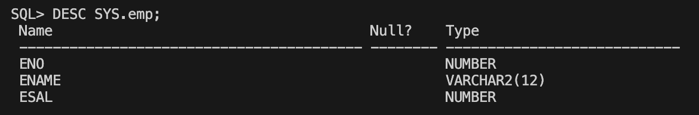
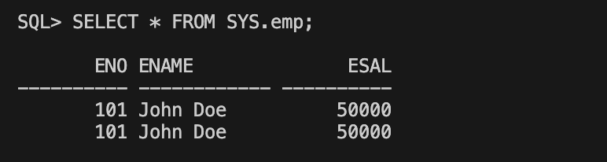
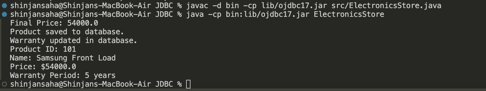
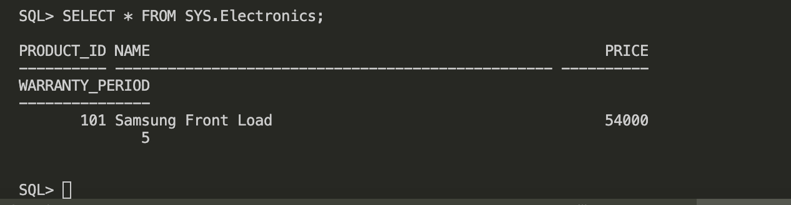

# JDBC-Oracle


## Steps to set it up in MAC M1/M2:-


 ### Download the Java JDK

### Downlaod Docker

### Install the Linux ARM 64 in zip only 

```bash 
 git clone https://github.com/oracle/docker-images
 ```
 ### go to docker-images--OracleDatabase--SingleInstance--dockerfiles-19.0.0.0 then copy paste the zip file of that linux over here  


### Then build the docker image with the command 
 
 ```bash
./buildContainerImage.sh -v 19.3.0 -e
```

 ### Run the Docker image 

 ```bash
 docker run -d --name oracle19 -e ORACLE_PWD=mypassword1 -p 1521:1521 oracle/database:19.3.0-ee
 ```
### After that downlaod the jar ile to build 7 execute JDBC according to your java jdk version this project use 17 from here :- https://www.oracle.com/database/technologies/appdev/jdbc-downloads.html


### Command to build the java class 

```bash
javac -d bin -cp lib/ojdbc17.jar src/Connect.java 
```

### Command to run the class  files

```bash
 java -cp bin:lib/ojdbc17.jar Connect
```

### Then to connect to sql write this command

```bash
 docker exec -it 15edb64e33c7 sqlplus system/mypassword1@//localhost:1521/orclpdb1
 ```

### then connect it with this connect SYS/mypassword1@//localhost:1521/orclpdb1 as sysdba;


# Create Table:-



# Insert Data:-



<br>
<br>


# Assign-8th-Q.no-6 Electronics Store



<br>
<br>



